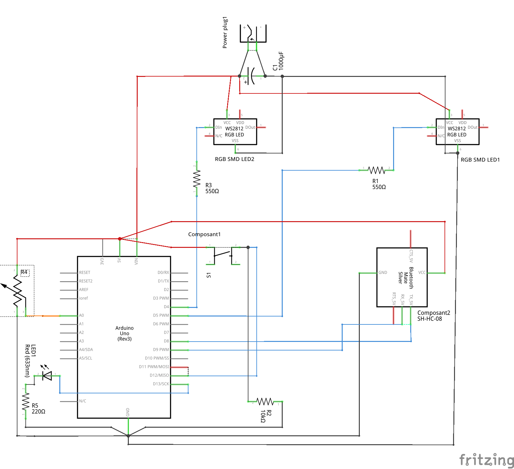

# Bibus prototype

Manage Bluetooth messages and Leds display by position in "Bibus" module prototype.
These programms are compatible with micro-controllers as Arduino Uno or ESP32  

## Bibus Init

Init Bluetooth local name using AT command. 

The name must match with a device name recorded in the Bibliobus API.

## Bibus serial

This programm needs [AltSoftSerial](https://github.com/PaulStoffregen/AltSoftSerial/) and [FastLED](https://github.com/FastLED/FastLED) librairies

It reads Bluetooth messages using the serial protocol and transforms them to light self-addressable LEDs (type WS2813)

## Bibus module's wiring diagram (for Arduino)
Arduino + module SH-HC-08

